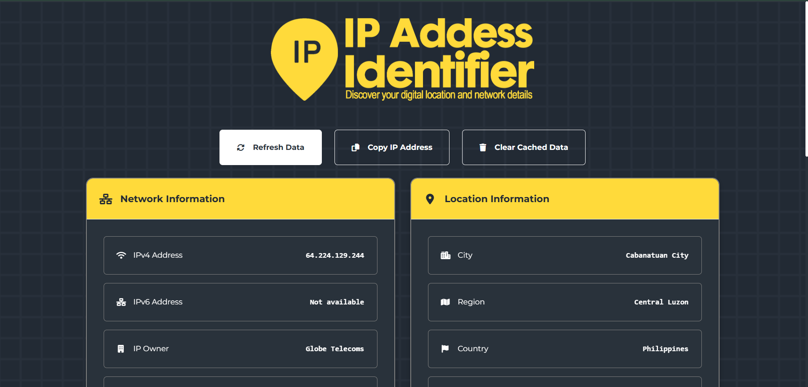

# IP Address Identifier

A modern Flask web application that displays comprehensive IP address information including geolocation, ISP details, network information, and interactive maps with privacy controls.


## Features

- 🌐 **IP Detection**: Automatic IPv4 and IPv6 address detection
- 📍 **Geolocation**: City, region, country, and coordinate information
- 🏢 **Network Details**: ISP, organization, ASN, and connection type
- 🗺️ **Interactive Map**: Leaflet-powered map with location markers
- 🔒 **Privacy Controls**: Data sanitization and privacy notices
- 📱 **Responsive Design**: Modern, mobile-friendly interface
- ⚡ **Performance**: Intelligent caching and API fallbacks
- 🎨 **Dark Theme**: Custom styled interface with yellow accents

## Screenshots


*Clean, modern interface showing network and location information*

---

## Features

### IP Address Detection

* Automatically detects both **IPv4** and **IPv6** addresses.

### Network Information

* IP Address (IPv4 & IPv6)
* IP Owner / Organization
* ISP Provider
* ASN Details
* Connection Type
* Partial Postal Code *(for privacy)*

### Location Details

* City
* Region / State
* Country
* Precise Coordinates

### Interactive Map

* Visualize IP location using **Leaflet.js**
* Zoom and pan controls for detailed exploration

### Privacy-Focused

* Displays only **partial postal codes**
* Clear privacy notices for sensitive data
* Special handling for **private network IPs**
* No permanent data storage

---

## Technologies Used

### Frontend

* **HTML5**, **CSS3**, **JavaScript**
* **Leaflet.js** for map rendering
* **Font Awesome** for icons
* **Google Fonts** (*Inter*) for typography

### Backend

* **Python**
* **Flask** web framework

---

## Installation Guide

### Method 1: Download ZIP (Recommended for beginners)

1. **Download the application**
   - Click the "Download ZIP" button on the repository page
   - Extract the ZIP file to your desired location
   - Navigate to the extracted folder

2. **Open Command Prompt/Terminal**
   ```bash
   # Windows: Press Win + R, type 'cmd', press Enter
   # macOS: Press Cmd + Space, type 'terminal', press Enter
   # Linux: Press Ctrl + Alt + T
   ```

3. **Navigate to the project directory**
   ```bash
   cd "C:\Users\Letson\OneDrive\Desktop\4ITE\SomethingIPAdd\IP-Add-Identifier"
   ```

### Method 2: Git Clone (For developers)

1. **Clone the repository**
   ```bash
   git clone https://github.com/yourusername/ip-address-identifier.git
   cd ip-address-identifier
   ```

## Setup Instructions

### 1. Create Virtual Environment (Recommended)

Creating a virtual environment keeps your project dependencies isolated:

```bash
# Create virtual environment
python -m venv venv

# Activate virtual environment
# On Windows:
venv\Scripts\activate

# On macOS/Linux:
source venv/bin/activate
```

You should see `(venv)` in your command prompt, indicating the virtual environment is active.

### 2. Install Dependencies

```bash
pip install -r requirements.txt
```

If you don't have a `requirements.txt` file, install dependencies manually:

```bash
pip install Flask requests
```

### 3. Add Required Files

Ensure these files are in your `templates` folder:

- **logo.png** - Your application logo (500px width recommended)
- **bg.png** - Background image (optional)

### 4. Run the Application

```bash
python app.py
```

You should see output similar to:
```
* Running on all addresses (0.0.0.0)
* Running on http://127.0.0.1:5000
* Running on http://[your-ip]:5000
```

### 5. Open in Browser

Navigate to: **http://localhost:5000**

---

## Feature Usage

* **Refresh Data:** Click the refresh button to get the latest IP information
* **Copy IP:** Quickly copy your detected IP address to clipboard
* **Clear Cache:** Remove saved IP data from browser storage
* **Interactive Map:** Explore your IP’s approximate location

---

##  Privacy Considerations

* Displays only **approximate location**
* Shows **partial postal codes**
* Detects and flags **private networks**
* Includes clear **privacy notices**
* **No permanent storage** of user data

---

## Project Structure

```
ip-address-identifier/
├── app.py
├── templates/
│   └── index.html
├── static/
│   ├── css/
│   │   └── style.css
│   └── js/
│       └── script.js
├── requirements.txt
└── README.md
```

---
## Acknowledgments

* [Leaflet.js](https://leafletjs.com) – for map visualization
* [Font Awesome](https://fontawesome.com) – for icons
* [Google Fonts](https://fonts.google.com) – for typography

---

**Happy IP tracking! 🌐**


